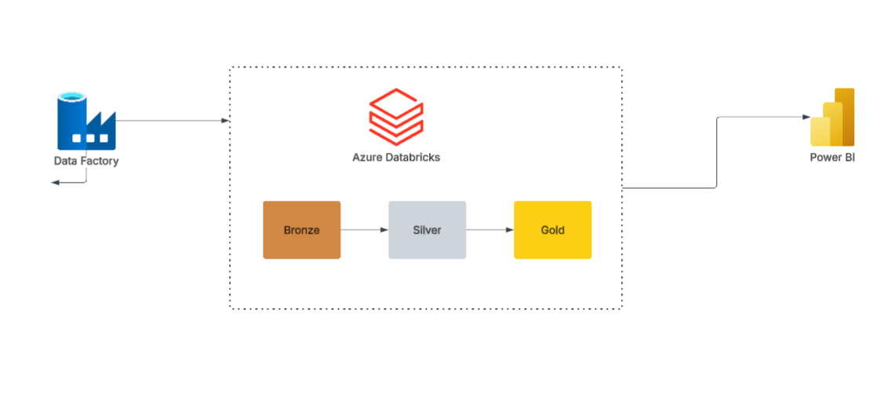

# Databricks-Formula1-Pipeline
This repository contains Formula1 pipeline built using Azure Databricks


# Formula 1 Data Engineering Lakehouse Project

### Azure Databricks | Apache Spark | Delta Lake | Unity Catalog | Lakeflow Jobs


---

## Project Overview

This project implements a complete end-to-end **Data Engineering Lakehouse platform** using **Azure Databricks and Apache Spark**.

The solution processes Formula 1 racing data and demonstrates how modern data platforms are designed and implemented in real-world environments.

The project follows the **Medallion Architecture pattern**:

* 🥉 Bronze Layer - Raw data ingestion
* 🥈 Silver Layer - Data cleansing and transformation
* 🥇 Gold Layer - Business-ready analytical datasets

The pipeline uses **PySpark, Spark SQL, Delta Lake, Unity Catalog, and Lakeflow Jobs** to build a scalable and maintainable data platform.

---

# Architecture



The data flow follows:

```
Formula 1 Data Sources
          |
          ▼
Azure Data Lake Storage Gen2
          |
          ▼
Bronze Layer
(Raw Delta Tables)
          |
          ▼
Silver Layer
(Cleansed & Transformed Data)
          |
          ▼
Gold Layer
(Analytics & Reporting Tables)
          |
          ▼
Databricks SQL Dashboards
```

---

# Technologies Used

| Technology                   | Purpose                       |
| ---------------------------- | ----------------------------- |
| Azure Databricks             | Data processing platform      |
| Apache Spark                 | Distributed data processing   |
| PySpark                      | Data transformation framework |
| Spark SQL                    | Data analysis and querying    |
| Delta Lake                   | Reliable storage layer        |
| Unity Catalog                | Data governance and security  |
| Azure Data Lake Storage Gen2 | Cloud storage                 |
| Lakeflow Jobs                | Workflow orchestration        |
| Databricks SQL               | Analytics and dashboards      |

---

#  Project Objectives

The goal of this project was to build practical experience with modern cloud data engineering concepts:

* Design a Lakehouse architecture
* Build scalable ETL pipelines
* Process large datasets using Spark
* Implement Delta Lake tables
* Perform incremental data processing
* Apply data governance using Unity Catalog
* Create automated workflows
* Develop analytical datasets for reporting

---

# Repository Structure

```
formula1-data-engineering-databricks
│
├── architecture
│   ├── Pipeline flow.png
│   └── medallion-architecture.png
│
├── notebooks
│   ├── 01_ingestion
│   ├── 02_bronze_layer
│   ├── 03_silver_layer
│   └── 04_gold_layer
│
├── sql
│   └── analytics_queries.sql
│
├── screenshots
│   ├── databricks-workspace.png
│   ├── unity-catalog.png
│   ├── lakeflow-job.png
│   └── dashboard.png
│
└── README.md
```

---

# Data Pipeline Implementation

## 🥉 Bronze Layer

The Bronze layer stores raw Formula 1 data with minimal transformation.

Activities:

* Ingest source files
* Store data as Delta tables
* Preserve historical records
* Maintain raw data availability

Example tables:

```
bronze.circuits
bronze.races
bronze.drivers
bronze.constructors
bronze.results
```

---

## 🥈 Silver Layer

The Silver layer prepares clean and reliable datasets.

Transformations include:

* Data type corrections
* Null handling
* Data standardization
* Joining related datasets
* Business rule application

Example:

```
silver.driver_results
silver.race_details
silver.constructor_results
```

---

## 🥇 Gold Layer

The Gold layer contains business-ready analytical models.

Examples:

* Driver performance analysis
* Constructor championship analysis
* Race statistics
* Season comparisons

Example:

```
gold.driver_standings
gold.constructor_standings
gold.race_summary
```

---

# Workflow Orchestration

The pipeline is automated using **Lakeflow Jobs**.

Workflow:

```
Ingestion Notebook
        |
        ▼
Bronze Processing
        |
        ▼
Silver Transformation
        |
        ▼
Gold Aggregation
        |
        ▼
Dashboard Refresh
```

---

# Data Governance

This project uses **Unity Catalog** for:

* Catalog management
* Schema organization
* Table permissions
* Data discovery
* Governance controls

Example hierarchy:

```
Catalog
 |
 └── Formula1
       |
       ├── Bronze
       ├── Silver
       └── Gold
```

---

# Analytics Dashboard

The project includes Databricks SQL dashboards providing insights such as:

* Top performing drivers
* Constructor rankings
* Race performance trends
* Season statistics

Dashboard screenshots:


